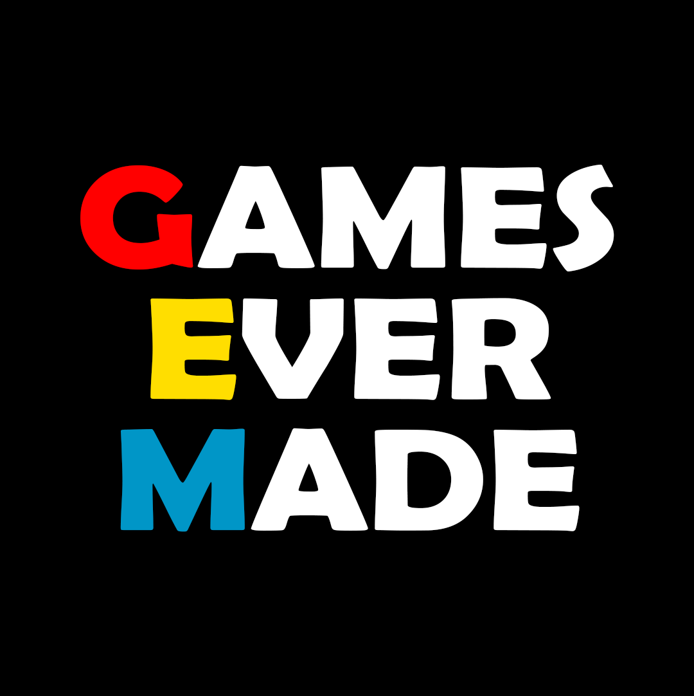

[JAVASCRIPT__BADGE]: https://img.shields.io/badge/Javascript-000?style=for-the-badge&logo=javascript
[KRITA__BADGE]: https://img.shields.io/badge/Krita-203759?style=for-the-badge&logo=krita&logoColor=EEF37B
[PHOTOSHOP__BADGE]: https://img.shields.io/badge/Adobe%20Photoshop-31A8FF?style=for-the-badge&logo=Adobe%20Photoshop&logoColor=black
[ITCHIO__BADGE]: https://img.shields.io/badge/Itch.io-FA5C5C?style=for-the-badge&logo=itchdotio&logoColor=white
[TRELLO__BADGE]: https://img.shields.io/badge/Trello-0052CC?style=for-the-badge&logo=trello&logoColor=white
[GIT__BADGE]: https://img.shields.io/badge/GIT-E44C30?style=for-the-badge&logo=git&logoColor=white
[Aseprite]: https://img.shields.io/badge/Aseprite-FFFFFF?style=for-the-badge&logo=Aseprite&logoColor=#7D929E

<div align='center'>
    
</div>
<a align="center" href="https://ldjam.com/events/ludum-dare/59/games">Ludum Dare #59</a>
<h1 align="center" style="font-weight: bold;">See Gnolls</h1>

[](https://img.shields.io/badge/Made_with-GDevelop-purple)
[](https://github.com/ellerbrock/open-source-badge/)
[](https://github.com/ellerbrock/open-source-badge/)
<br>

<div align='center'>

![javascript][JAVASCRIPT__BADGE]
![krita][KRITA__BADGE]
![aseprite][Aseprite]
![photoshop][PHOTOSHOP__BADGE]
[![itch.io][ITCHIO__BADGE]](https://games-ever-made.itch.io/overpowered?secret=PbdAZeyWql0jcwVfFGzCQfazhU)
![trello][TRELLO__BADGE]
![git][GIT__BADGE]

</div>

<p align="center">
 <a href="#about">About</a> • 
 <a href="#controls">Controls</a> • 
  <a href="#colab">Collaborators</a> •
 <a href="#references">References</a> •
 <a href="#aknowledges">Aknowledges</a> •
</p>

<p align="center">
    </img> |
    </img>
    <br/>
    Project developed during the Ludum Dare #59. The project was based on the theme "Signal".
</p>


<h2 id="started">📌 About  </h2>

The game is about managing a watch tower where you have to **see gnolls**. The gnolls come in waves and your job is to warn the village about what is coming from where. The goal is to resist the attacks by correctly warning the village through signals (flags, horns, torches, etc), where each signal has a meaning that you, as a player, have to remember and the complexity increases at every wave.

### Features
- The player view is alternated between 4 cardinal positions.
- The background should have defining features to indicate the compass direction (ex.: mountain for north, lake for east, etc).

### Gameplay Loop
- The player is introduced to the task and the rules.
- A day begins. Waves comes.
- Player warns about dangers. The village dispatch appropriate response


<p>Visit our projects, clicking on the button bellow</p>

[![itch.io][ITCHIO__BADGE]](https://games-ever-made.itch.io/)

<br/>
<h2 id="controls">🎛️ Controls </h2>

- Drag and drop for the items
- Dragging an item up activates it
- You can drag around the items to rearrange them in your watch tower.

<br/>

<h2 id="colab">🤝 Collaborators</h2>

Special thank you for all people that contributed for this project.

<table>
  <tr>
    <td align="center">
      <a href="https://github.com/lindotex">
        <br>
        <sub>
          <b>Alisson Lindote</b><br/>
          <i>Project, Marketing, Developer</i>
        </sub>
      </a>
    </td>
    <td align="center">
      <a href="https://github.com/andrew-mendes">
        <br>
        <sub>
          <b>Andrew Mendes</b><br/>
          <i>Artist, Designer, Developer</i>
        </sub>
      </a>
    </td>
    <td align="center">
      <a href="https://github.com/fgil90">
        <br>
        <sub>
          <b>Felipe Gil</b><br/>
          <i>Developer, Level Designer</i>
        </sub>
      </a>
    </td>
    <td align="center">
      <a href="https://github.com/MarceloLMoreira">
        <br>
        <sub>
          <b>Marcelo 'Holysparks'</b><br/>
          <i>CEO, Developer, Level Designer</i>
        </sub>
      </a>
    </td>
  </tr>
</table>

<h2 id="references">📝 References </h2>

This is the list of games, articles, creators that we took inspiration to work in this project.

<table>
  <tr>
    <td align="center">
      <a href="https://store.steampowered.com/app/2824490/He_is_Coming/">
        <br>
        <sub>
          <b>He is Coming. 2025</b><br/>
          <i>Chronicle</i>
        </sub>
      </a>
    </td>
    <td align="center">
      <a href="https://store.steampowered.com/app/239030/Papers_Please/">
        <br>
        <sub>
          <b>Papers, please. 2013</b><br/>
          <i>Lucas Pope</i>
        </sub>
      </a>
    </td>
  </tr>
</table>

<h2 id="aknowledges">Special tanks and Aknowledges</h2>

Here is our Special Thanks and Aknowledges for all of those who help us developing this project:

```cs
 {
    "plataform":"GDevelop",
    "portal":"Itch.io",
    "graph":"krita",
 }
```

